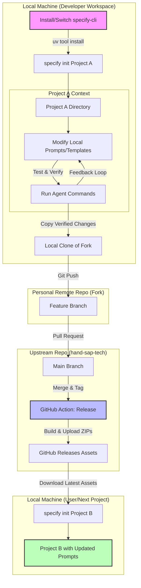
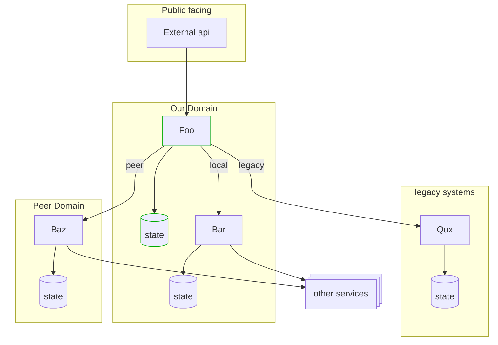

# Spec Kit for ABAP

Spec Kit for ABAP 是一个专门为 ABAP 开发设计的规范驱动开发（Spec-Driven Development）工具包。它基于 Spec Kit 核心理念，提供了针对 ABAP 场景（如 RAP、BTP 等）的专用模板和工作流。

本文档详细介绍了从安装工具、初始化项目、定制开发提示词（Prompts）与模板，到发布并复用这些资产的完整流程。

## 🚀 完整工作流详解

### 1. 安装与切换工具 (Install/Switch)

首先，你需要将本地的 `specify-cli` 工具切换到 `spec-kit-abap` 的版本。这是因为官方的 `specify-cli` 可能不包含 ABAP 特定的逻辑和模板源。

我们使用 `uv` 工具直接从 GitHub 仓库安装：

```bash
# 安装或强制切换到 spec-kit-abap 版本
uv tool install specify-cli --force --from git+https://github.com/hand-sap-tech/spec-kit-abap.git
```

这一步确保你的 `specify` 命令使用的是支持 ABAP 转换类型的定制版本。

### 2. 初始化项目 (Init)

安装完成后，你可以开始初始化一个 ABAP 项目。`specify init` 命令会引导你选择 AI 助手（Agent）和 ABAP 转换类型（Conversion Type）。

```bash
# 初始化新项目
specify init my-abap-project

# 或者指定参数初始化
specify init my-abap-project --ai claude --conversion-type managed-report
```

**转换类型 (Conversion Types):**
- `managed-report`: 管理型报表 (RAP)
- `custom-entity`: 自定义实体 (RAP)
- `managed-platform`: 管理型平台 (BTP)
- `unmanaged-platform`: 非托管平台 (BTP)

初始化过程会从 GitHub Release 下载对应的模板包，并解压到你的项目目录中，生成 `.spec/` 目录、Agent 专属配置目录（如 `.codex/`、`.claude/` 等）以及初始的规范文件。

### 3. 测试提示词和模板 (Test Prompts & Templates)

在项目开发过程中，你可能会发现默认的提示词（Prompts）或代码模板不满足需求。你可以直接在本地项目中修改它们进行测试：

1.  **定位文件**: 模板文件通常位于项目根目录的隐藏文件夹中，例如 `.claude/commands/` (Claude) 或 `.github/agents/` (Copilot)。
2.  **修改**: 编辑这些 Markdown 或 TOML 文件，调整提示词逻辑。
3.  **验证**: 在当前项目中运行 `/speckit.specify` 或 `/speckit.implement` 等命令，验证修改后的提示词是否生成了更好的 ABAP 代码。

### 4. 提交更改 (Submit Changes)

当你验证了一套更优秀的提示词或模板后，你应该将它们贡献回 `spec-kit-abap` 仓库。请遵循标准的开源贡献流程（Fork & Pull Request）：

1.  **Fork 仓库**: 在 GitHub 上将 `hand-sap-tech/spec-kit-abap` 仓库 Fork 到你个人的账号下。
2.  **克隆个人仓库**: 将你 Fork 后的个人仓库克隆到本地。
    ```bash
    git clone https://github.com/<your-username>/spec-kit-abap.git
    ```
3.  **配置上游 (Upstream)**: 将官方仓库配置为 `upstream` 远程仓库，以便后续同步更新。
    ```bash
    git remote add upstream https://github.com/hand-sap-tech/spec-kit-abap.git
    ```
4.  **同步主分支**: 定期（特别是在开始新工作前）将官方仓库的更新同步到你的本地和个人远程仓库。
    ```bash
    git checkout main
    git pull upstream main
    git push origin main
    ```
5.  **创建功能分支**: 基于同步后的本地 `main` 分支创建一个新的功能分支（命名规则见下文）。
    *   **注意**：不要直接在本地 `main` 分支或 `origin/main` 上提交代码，它们应始终保持与 `upstream/main` 同步。
    ```bash
    git checkout -b claude-managed-report-0.2.0
    ```
6.  **应用更改**: 将你在项目中测试通过的提示词同步修改到 `templates/by-agents/...` 目录下的源文件中。
7.  **提交与推送**: 提交更改并推送到你的**个人远程仓库 (origin)**。
    ```bash
    git push origin claude-managed-report-0.2.0
    ```
8.  **发起 Pull Request (PR)**: 在 GitHub 上，从你的个人仓库 (`origin`) 的**功能分支**向官方仓库 (`upstream`) 的 **`main` 分支**发起 Pull Request。

### 5. 生成发布版本 (Release)

当你的 PR 被合并到官方仓库的 `main` 分支后，仓库管理员会创建一个新的 Release 版本。

1.  **GitHub Action**: 仓库配置了自动化工作流，当创建新的 Tag (如 `v0.2.0`) 时，会自动触发打包流程。
2.  **打包**: 脚本会将 `templates/` 目录下的文件按照 Agent 和 Conversion Type 打包成 ZIP 文件（例如 `spec-kit-abap-template-claude-managed-report-v0.2.0.zip`）。
3.  **发布**: 这些 ZIP 包会被上传到 GitHub Release 的 Assets 中。

### 6. 复用新提示词 (Reuse)

一旦新版本发布，你和其他团队成员就可以在新的项目中直接使用这些更新后的提示词了。

1.  **再次 Init**: 当你运行 `specify init new-project` 时，工具会自动检测并下载最新发布的 Release 包。
2.  **自动应用**: 新项目将自动包含你之前提交并合并的优化提示词，无需再次手动修改。

---

## 📊 工作流示意图

下面的流程图展示了从本地开发到仓库贡献，再到新项目复用的完整闭环。



---

## 🤖 支持的 AI 助手 (Supported Agents)

Spec Kit for ABAP 支持多种主流 AI 编程助手。每种助手都有其特定的配置文件格式和目录结构。

| Agent | CLI Tool | 配置文件格式 | 说明 |
| :--- | :--- | :--- | :--- |
| **Claude Code** | `claude` | Markdown | Anthropic 的 Claude CLI |
| **Gemini CLI** | `gemini` | TOML | Google 的 Gemini CLI |
| **GitHub Copilot** | N/A | Markdown | VS Code 内置 Copilot |
| **Cursor** | `cursor-agent` | Markdown | Cursor 编辑器 CLI |
| **Windsurf** | N/A | Markdown | Windsurf IDE 工作流 |
| **Qwen Code** | `qwen` | TOML | 阿里云通义灵码 CLI |
| **Opencode** | `opencode` | Markdown | Opencode CLI |
| **Codex CLI** | `codex` | Markdown | Codex CLI |
| **Kilo Code** | N/A | Markdown | Kilo Code IDE |
| **Auggie CLI** | `auggie` | Markdown | Auggie CLI |
| **Roo Code** | N/A | Markdown | Roo Code IDE |
| **CodeBuddy** | `codebuddy` | Markdown | CodeBuddy CLI |
| **Amazon Q** | `q` | Markdown | Amazon Q Developer CLI |
| **Amp** | `amp` | Markdown | Amp CLI |
| **SHAI** | `shai` | Markdown | SHAI CLI |
| **IBM Bob** | N/A | Markdown | IBM Bob IDE |

---

## 📝 贡献指南

### 提交规范 (Commit Guidelines)

为了保持仓库的整洁和版本管理的规范，请在贡献代码时遵守以下规则。

#### 1. 分支命名规则 (Branch Naming)

请使用以下格式创建分支：

*   **标准格式**: `<agent>-<转换类型>-版本号`
    *   示例: `claude-managed-report-0.1.0`
    *   示例: `copilot-custom-entity-0.2.1`
*   **热修复 (Hotfix)**: `hotfix/<agent>-<转换类型>-版本号`
    *   示例: `hotfix/claude-managed-report-0.1.1`

#### 2. 提交流程 (Submission Process)

1.  **新建分支**: 基于 `main` 分支创建符合上述命名规则的新分支。
2.  **本地验证**: 完成修改后，务必运行本地打包脚本或测试命令进行验证。
3.  **提交 PR**: 不要直接合并到 `main` 分支。请发起 Pull Request，并在描述中说明变更内容和测试结果。

### 添加新模板

如果你想为特定的 Agent 或转换类型添加新的模板：

1.  检查 `templates/by-agents/` 目录下是否已有对应文件夹。
2.  如果没有，请参考 `AGENTS.md` 中的指南创建目录结构。
3.  确保模板文件格式（Markdown/TOML）与 Agent 要求一致。
4.  提交 PR 前，请务必在本地进行测试。




